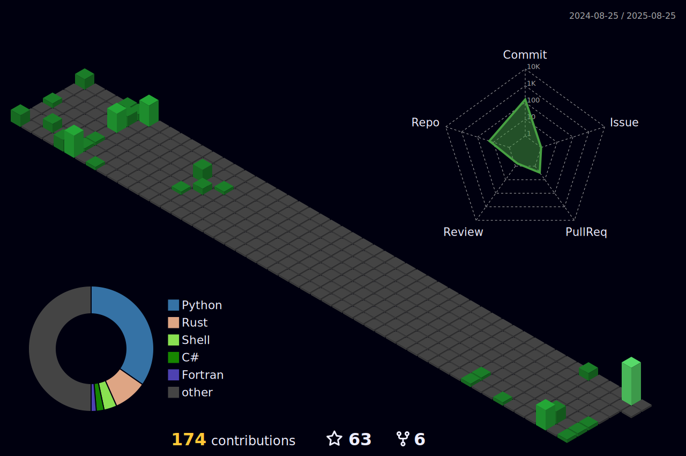

# Hi, I'm havok 👋 

> **Senior Fraud Investigator | Technical Security Researcher | Army Veteran**

---

### 👨‍💻 About Me

I am a professional **Fraud & Financial Crimes Investigator** and **Technical Security Researcher** based in Phoenix, AZ. With 8 years of service in the **U.S. Army**, I specialize in defensive and offensive security, moving between deep-dive financial forensics and low-level exploit development. 

Whether it's parsing logs with PowerShell, hunting vulnerabilities in the wild, or stress-testing engineering-grade filaments for structural integrity, I’m driven by a need to understand how things break—and how to fix them.

---

### 📊 Activity & Contributions

  

 

  
   
  
   
  

---

### 🚀 Current Research & Projects

* **Vicidial Exposure Study:** Authoring a whitepaper on the global footprint of exposed Vicidial servers identified via wide-scale network scanning.
* **Hardware Monitoring:** Developing a self-hosted **Flask/MQTT dashboard** for real-time monitoring and telemetry of Bambu Lab H2S systems.
* **Material Science:** Conducting technical studies on **PA612-CF15** and **PPA-CF** performance in extreme high-heat environments.
* **Robotics:** Integrating **NVIDIA Jetson** compute modules into high-performance RC platforms for edge AI applications.

---

### 🛠️ Languages and Tools

**Development & Scripting**

  
  
  
  
  

**Security & Infrastructure**

  
  
  
  

---

### 📈 Global Presence

  

  

---
