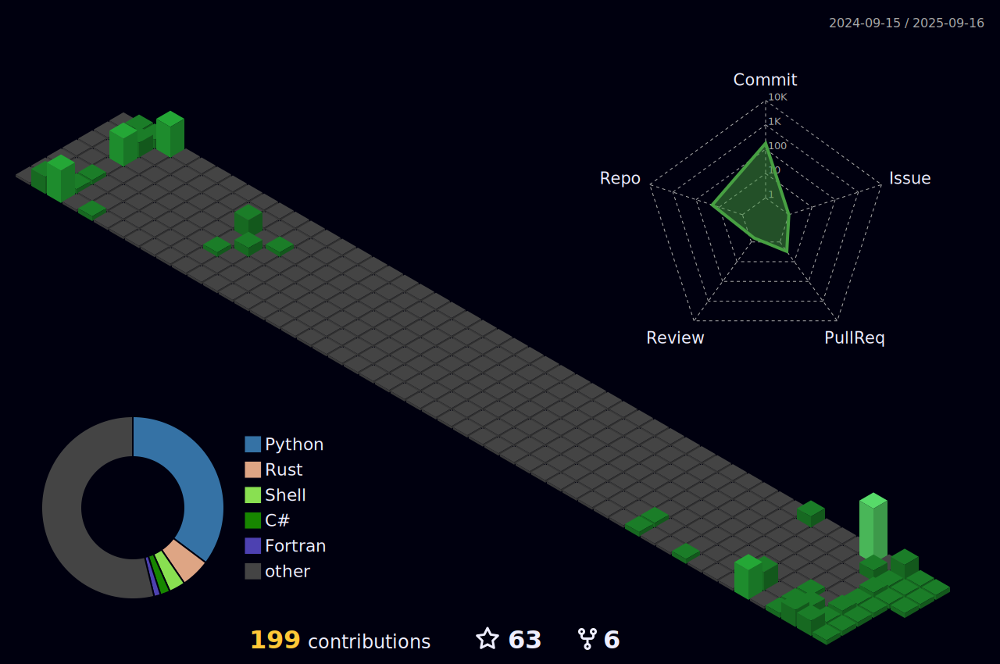

# Hi, I'm havok 👋 

---

### 👨‍💻 About Me:

I'm a Cybersecurity Enthusiast and Researcher. I specialize in exploring security vulnerabilities, developing custom tools for testing, and responsibly sharing my findings. My focus is on understanding systems to help improve their security and contribute to a safer digital environment.

---

### :hammer_and_wrench: Languages and Tools:

  &nbsp;
  &nbsp;
  &nbsp;
  &nbsp;
  &nbsp;

  &nbsp;
  &nbsp;
  &nbsp;
  &nbsp;

  &nbsp;
  &nbsp;

---

### :fire: My GitHub Stats:

  <!-- GitHub Stats -->
  

  <!-- GitHub Streak -->
  

  <!-- Top Languages -->
  

---

### 🔍 What I Do:

- Research and exploit vulnerabilities in systems, networks, and software.
- Develop custom scripts and tools for penetration testing and ethical hacking with some fun projects here and there.
- Perform vulnerability assessments and disclose findings responsibly.
- Engage in Capture the Flag (CTF) challenges to stay sharp and refine my techniques.
- Contribute to the cybersecurity community by sharing knowledge and tools.

---

### 🚀 Current Projects:

- Building and refining tools for automating ethical hacking tasks.
- Writing a custom Python program for exploit research and proof-of-concept (PoC) development.
- Contributing to open-source security tools and frameworks.

---

### 💡 My Interests:

- Reverse engineering and binary exploitation.
- Network security and red teaming.
- Writing efficient code in Python, Rust, and C++ for cybersecurity applications.
- Collaborating on open-source security projects and improving vulnerability scanning tools.
- Social Engineering
- VoIP

---

<!--
  
-->

---

<!-- -->

<!--div align="center">  </div-->

---

<!--  -->

